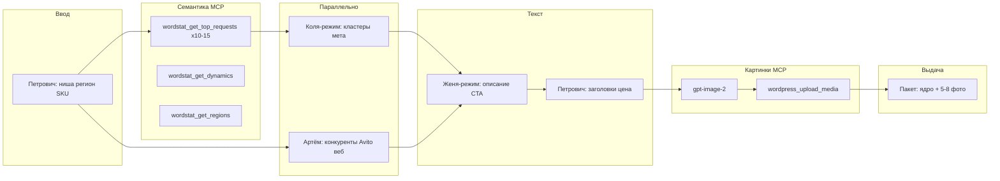

# Skill: avito-ad-pipeline (Legis24)

Пайплайн одного объявления Avito от SKU до пакета на диске (без Telegram).

## XML автозагрузки (обязательное правило)

Перед выдачей XML прочитай **`shared/legis24-avito-xml-rules.md`**.  
Генерация: `python3 scripts/avito-generate-autoload-xml.py` — скрипт уже вшивает проверенные поля.  
Проверка: https://autoload.avito.ru/format/xmlcheck/

## Mermaid (канон для документации)



## MCP Kovcheg — семантика

| Инструмент | Когда | Минимум |
|------------|--------|---------|
| `wordstat_get_top_requests` | После ввода Петровича | 10–15 вызовов, разные семена |
| `wordstat_get_dynamics` | 1 главный ключ | 1 вызов |
| `wordstat_get_regions` | Регион из ввода | 1 вызов |

Семена брать из `=== ПЕТРОВИЧ (ВВОД) ===` + `shared/legis24-site-context.md`.

## MCP Kovcheg — картинки

| Шаг | Инструмент | Назначение |
|-----|------------|------------|
| I1 | `gpt-image-2` (fallback `z-image`) | Главное фото 1:1, деловой стиль |
| I2 | `wordpress_upload_media` | Публичный HTTPS для `<Images>` в XML |

Агент: `visual-avito`. Публикация фида: `yura-avito`.

**Промпт:** ниша SKU + документы с **русскими** подписями (кириллица), без английского на бумаге. См. `shared/legis24-image-prompt-rules.md`.  
**Минимум:** 1 URL на SKU в `image_url` генератора.

## Telegram

**Запрещено** в пайплайне Avito. Уведомления — отдельный канал, не через MCP здесь.

## Артефакты на диске

```
avito/out/{sku}.md          # финальная карточка
.cursor/legis24-avito-handoff.md
.cursor/legis24-avito-fragments/{kolya,artyom,...}.md
```

## SKU naming

`{ниша-кратко}-{регион}` латиницей, например: `vozrazhenie-fns-rf`

## Ограничения Avito

- Заголовок: **≤ 50 символов**
- Описание: до ~7500 символов (целимся 1500–3000)
- Цена: только из `legis24-site-context.md` или явного ТЗ пользователя
