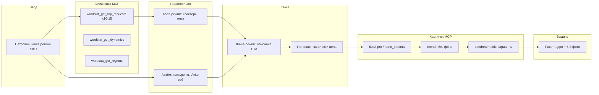

# Skill: avito-ad-pipeline (Legis24)

Пайплайн одного объявления Avito от SKU до пакета на диске (без Telegram).

## XML автозагрузки (обязательное правило)

Перед выдачей XML прочитай **`shared/legis24-avito-xml-rules.md`**.  
Генерация: `python3 scripts/avito-generate-autoload-xml.py` — скрипт уже вшивает проверенные поля.  
Проверка: https://autoload.avito.ru/format/xmlcheck/

## Mermaid (канон для документации)



## MCP Kovcheg — семантика

| Инструмент | Когда | Минимум |
|------------|--------|---------|
| `wordstat_get_top_requests` | После ввода Петровича | 10–15 вызовов, разные семена |
| `wordstat_get_dynamics` | 1 главный ключ | 1 вызов |
| `wordstat_get_regions` | Регион из ввода | 1 вызов |

Семена брать из `=== ПЕТРОВИЧ (ВВОД) ===` + `shared/legis24-site-context.md`.

## MCP Kovcheg — картинки

| Шаг | Инструмент | Назначение |
|-----|------------|------------|
| I1 | `flux2-pro-text-to-image` или `nano_banana_2` | Базовые сцены (офис, документы, без лиц реальных людей) |
| I2 | `recraft_remove_background` | PNG без фона для коллажа |
| I3 | `seedream-4_5-edit` | 2–3 варианта: другой фон, акцент на текст/печать |

**Промпт визуала:** деловой стиль, светлый фон, без водяных знаков, без чужих логотипов.  
**Соотношения:** `1:1` (главное), `4:3` (доп. в галерее).  
**Количество:** 5–8 URL в пакете.

## Telegram

**Запрещено** в пайплайне Avito. Уведомления — отдельный канал, не через MCP здесь.

## Артефакты на диске

```
avito/out/{sku}.md          # финальная карточка
.cursor/legis24-avito-handoff.md
.cursor/legis24-avito-fragments/{kolya,artyom,...}.md
```

## SKU naming

`{ниша-кратко}-{регион}` латиницей, например: `vozrazhenie-fns-rf`

## Ограничения Avito

- Заголовок: **≤ 50 символов**
- Описание: до ~7500 символов (целимся 1500–3000)
- Цена: только из `legis24-site-context.md` или явного ТЗ пользователя
