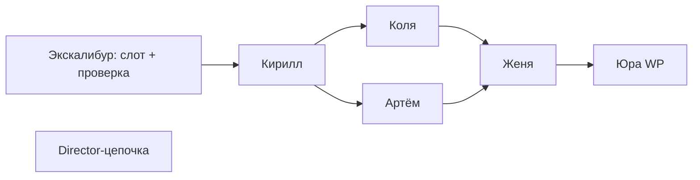

# Skill: excalibur-blog-automation

Автопубликация блога Legis24 — **2 статьи в сутки**.

## Расписание

| Слот | Время (МСК) | Статей |
|------|-------------|--------|
| `morning` | 09:00 | 1 |
| `evening` | 18:00 | 1 |

**Итого:** 2 лонгрида / день на advokat-vsem.ru.

Настройте **два** триггера (Cloud Agent schedule / cron / Make):
- утренний с `Слот: morning`
- вечерний с `Слот: evening`

## Канонический промпт (копировать в автоматизацию)

Файл: `shared/excalibur-automation-prompt.md`

Краткая форма:

```
@excalibur
Слот: morning
Опубликуй одну статью в блог Legis24 по полному пайплайну (Кирилл → Коля‖Артём → Женя → Юра).
Проверь дубли в legis24-published-pages.md. Статус publish. Отчёт ЭКСКАЛИБУР.
```

Вечерний — то же с `Слот: evening`.

## Пайплайн (одна статья)



## Темы (приоритет)

1. ФНС: акт, требование, возражение, блокировка счёта
2. Арбитраж: иск, отзыв, банкротство
3. Уголовно-налоговый риск, СК
4. ИС / товарные знаки (если нет свежей налоговой темы)

Wordstat: 8–15 вызовов на статью.

## Обложка статьи

- Модели: **gpt-image-2** → **nano_banana_2**
- Промпт: `Post title reference: «{H1}»` + кириллица (`legis24-image-prompt-rules.md`)
- `wordpress_upload_image_from_url` → `wordpress_set_featured_image`

## Лонгрид

- HTML (не Markdown), CTA: order@advokat-vsem.ru, advokat-vsem.ru
- 6000–12000 знаков
- Таблица цен Legis24 в конце (из site-context)

## Журналы

| Файл | Назначение |
|------|------------|
| `shared/excalibur-run-log.md` | Слоты, статусы, URL |
| `shared/legis24-published-pages.md` | Канон опубликованного |
| `shared/legis24-topics-ledger.md` | Темы selected/published |

## SKIP (не публиковать)

- Уже есть запись `published` для этого слота сегодня
- Тема-дубль в published-pages
- Юра вернул ошибку WP — записать `❌ БЛОКЕР`, не повторять тему как published

## После публикации (опционально)

Пользователь может отдельно: `@director-avito` с нишей из H1 — объявление Avito **не входит** в Экскалибур.
