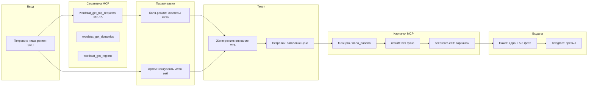

# AGENTS.md — Legis24 / MyFirstProject

## Два пайплайна

| Пайплайн | Директор | Продукт |
|----------|----------|---------|
| **Статьи** (лонгриды WP) | `director` (ветка `origin/cursor/a3-a2ec`) | Страница на advokat-vsem.ru |
| **Avito** (объявления) | `director-avito` | Карточка SKU + фото + Telegram |

Общий контекст бренда: `shared/legis24-site-context.md`.

## Avito — агенты и роли

| Агент | Файл | Skill |
|-------|------|-------|
| Директор Avito | `.cursor/agents/director-avito.md` | `avito-ad-pipeline` |
| **Петрович (только Avito)** | `.cursor/agents/petrovich.md` | `avito-ad-pipeline` |
| Коля (Avito) | `.cursor/agents/seo-kolya-avito.md` | `seo-kolya-avito-mode` |
| Артём (Avito) | `.cursor/agents/artyom-avito.md` | `researcher-artyom-avito-mode` |
| Женя (Avito) | `.cursor/agents/zhenya-avito.md` | `seo-writer-zhenya-avito-mode` |
| Визуал | `.cursor/agents/visual-avito.md` | `visual-avito-images` |

Handoff: `.cursor/legis24-avito-handoff.md`  
Инструкция запуска: `avito/AUTOMATION.md`

## Статьи — отдельный пайплайн (без Петровича)

Полный офис лонгридов (Кирилл, Коля, Артём, Женя, Артур, Алина, Борис, Наташа, Юра, Макс, Лёня) — ветка **`origin/cursor/a3-a2ec`**, директор `director`. **Петрович в статьях не участвует.**

**Связка статья → Avito:** после лонгрида запускай `@director-avito` (ниша из H1 → SKU). Тексты объявления готовит Петрович и `*-avito` агенты, не Женя-лонгрид.

## Секреты

- Avito API: `Avito_client-id`, `Avito_client_secret`
- MCP Kovcheg: Wordstat, изображения, Telegram
- Сайт: https://advokat-vsem.ru

## Cloud Agent

Ветки: `cursor/<name>-81c8`. Перед пайплайном Avito: `@director-avito` + ниша, регион, SKU.
