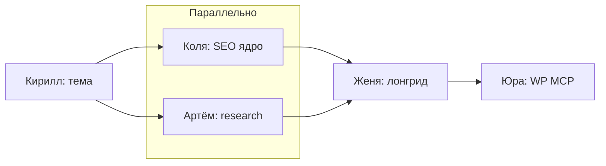
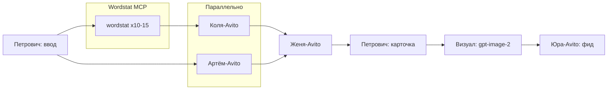

# AGENTS.md — Legis24 / MyFirstProject

## Два пайплайна

| Пайплайн | Директор | Продукт |
|----------|----------|---------|
| **Статьи** (лонгриды WP) | `director` | Страница на advokat-vsem.ru |
| **Avito** (объявления) | `director-avito` | Карточка SKU + фото + XML-фид (без Telegram) |

Общий контекст бренда: `shared/legis24-site-context.md`.

---

## Статьи WP — агенты

| Агент | Файл | Handoff |
|-------|------|---------|
| Директор | `.cursor/agents/director.md` | `legis24-wp-handoff.md` |
| Кирилл | `.cursor/agents/kirill.md` | |
| Коля | `.cursor/agents/seo-kolya.md` | фрагмент `kolya.md` |
| Артём | `.cursor/agents/artyom.md` | фрагмент `artyom.md` |
| Женя | `.cursor/agents/zhenya.md` | |
| Юра | `.cursor/agents/yura.md` | `legis24-published-pages.md` |

Запуск: `@director` + тема (или «новость дня»).

---

## Avito — агенты

| Агент | Файл | Skill |
|-------|------|-------|
| Директор Avito | `.cursor/agents/director-avito.md` | `avito-ad-pipeline` |
| **Петрович** | `.cursor/agents/petrovich.md` | `avito-ad-pipeline` |
| Коля (Avito) | `.cursor/agents/seo-kolya-avito.md` | `seo-kolya-avito-mode` |
| Артём (Avito) | `.cursor/agents/artyom-avito.md` | `researcher-artyom-avito-mode` |
| Женя (Avito) | `.cursor/agents/zhenya-avito.md` | `seo-writer-zhenya-avito-mode` |
| Визуал | `.cursor/agents/visual-avito.md` | `visual-avito-images` |
| Юра (Avito) | `.cursor/agents/yura-avito.md` | — |

Handoff: `.cursor/legis24-avito-handoff.md`  
Фрагменты: `.cursor/legis24-avito-fragments/`  
Инструкция: `avito/AUTOMATION.md`  
**XML:** `shared/legis24-avito-xml-rules.md`

Запуск: `@director-avito` + ниша, регион, SKU.

---

## Разделение зон

| Задача | Кто |
|--------|-----|
| **Страница сайта** | `director` → Кирилл, Коля, Артём, Женя, Юра |
| **Объявление Avito** | `director-avito` → Петрович, `*-avito`, визуал, Юра-Avito |

Петрович **не** делает лонгриды. Юра **не** публикует Avito (это `yura-avito`).

После статьи можно `@director-avito` с нишей из H1.

## Telegram (маркетинг)

| Агент | Файл | Skill |
|-------|------|-------|
| **Макс** (стратег канала) | `.cursor/agents/max-telegram.md` | `telegram-channel-strategy` |
| Telegram Legis24 (тексты) | `.cursor/agents/telegram-legis24.md` | `legis24-telegram-post` |
| Визуал Telegram | `.cursor/agents/visual-telegram.md` | `legis24-telegram-post` |

- Анализ сайта: `shared/legis24-site-analysis-telegram.md`
- Серия постов: `content/telegram/series/legis24-2026-05-series.md`
- Обложка `gpt-image-2`, **5–10 хештегов**, MCP `@kovcheglifan_bot`

Запуск: `@max-telegram` — план/серия; `@telegram-legis24` — один пост; публикация в личку `1332429170` по запросу.

## Секреты

- Avito API: `Avito_client-id`, `Avito_client_secret`
- MCP Kovcheg: Wordstat, `gpt-image-2`, WordPress
- Telegram для Avito **не использовать**

## Cloud Agent

Ветки: `cursor/<name>-81c8`.
